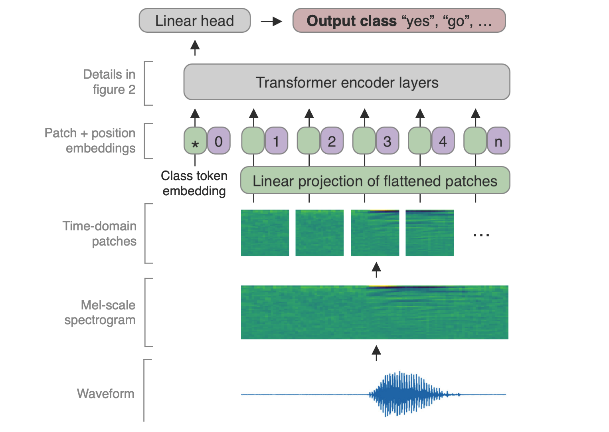
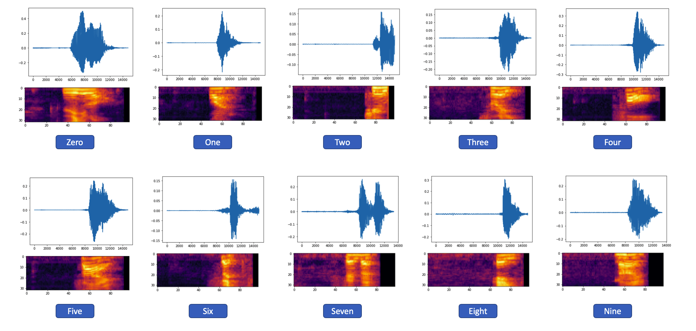

# Keyword Transformer: A Self-Attention Model for Keyword Spotting

使用 TensorFlow Speech Command 資料集訓練英文 0~9 聲音數字辨識，並採用 Transformer 模型架構訓練。

## Example
### 模型訓練
參考[keyword_transformer.ipynb](https://github.com/1010code/keyword-transformer/blob/main/keyword_transformer.ipynb)。

### ONNX Runtime 模型推論(python)

## Tool
- [voice recorder](https://voice-recorder-online.com/)
- [audio converter](https://audio.online-convert.com/convert-to-wav)

## Reference
- [Keyword Transformer: A Self-Attention Model for Keyword Spotting](https://arxiv.org/pdf/2104.00769v2.pdf)